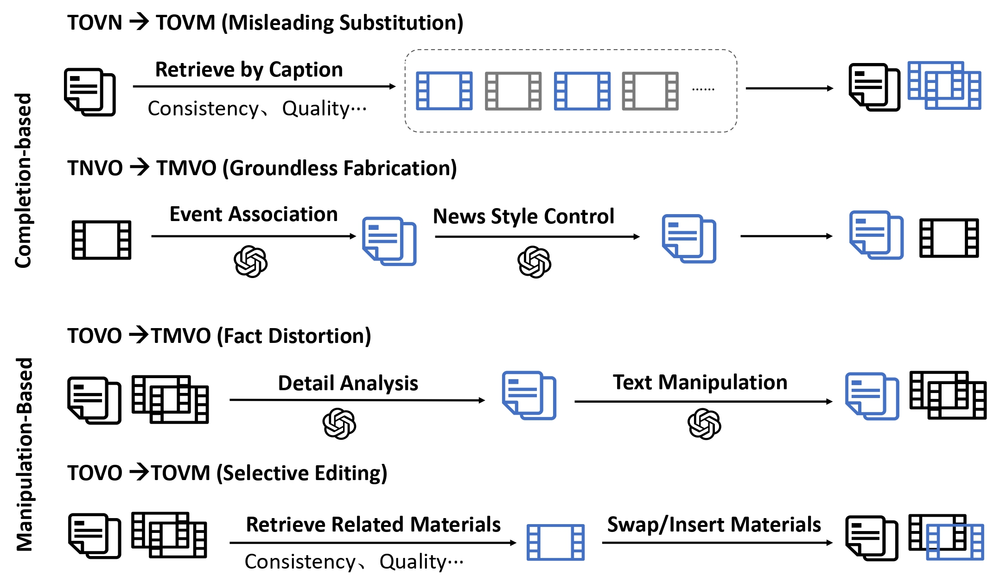
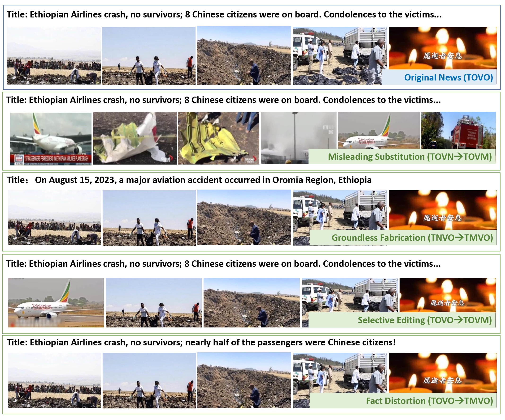

<!-- # Enhancing Fake News Video Detection via LLM-Driven Creative Process Simulation
## Overall Framework
Our proposed framework is illustrated below:


**Figure 1.** *The overall framework consists of two modules: a data synthesis module that synthesize diverse short video fake news, and an enhanced model training module that incorporates synthetic data via uncertainty-based dynamic sampling and re-training.*

## Agentic Workflow for Data Synthesis
The two key implementation steps for this automated synthesis are described in detail below.
### Material Library Construction


- For the textual material library, we employ Qwen-Max~\cite{qwen1.5} to analyze captions from existing news short videos, filtering out emotionally charged texts with little informational value and obscure rumor texts unsuitable for video presentation.
- For the visual material library, we first utilize the shot segmentation model TransNet-v2 to segment existing news videos into raw visual clips. To facilitate subsequent material selection, these clips are further processed using Qwen-VL-Max for content-aware understanding and archival.


**Figure 2.** *Example of an archival entry for a visual material clip.*


**Figure 2.** *Distribution of visual material clip types.*
"Real-shot video" emerges as the predominant category, constituting 64\% of the Chinese library and 74\% of the English library, followed by "real-shot photo" at 13\% and 11\%, respectively. This prevalence underscores the centrality of real-shot content in news video production. Notably, differences emerge between the datasets, for example, the Chinese library features a higher proportion of "surveillance recording" clips compared to its English counterpart, suggesting culturally influenced preferences in material curation.


**Figure 2.** *Distribution of scores for visual material clips in terms of visual quality, newsworthiness, and visual impact.*
 Overall, both datasets exhibit high-quality clips, with over 70\% scoring 3 or above for visual quality, and balanced distributions for newsworthiness and visual impact, meeting the needs of automated news content synthesis. Comparing the datasets, Chinese materials show stronger newsworthiness (over 80\% scoring 3 or higher) but lower visual impact (around 60\% at 3 or higher), while English materials excel in visual impact (over 80\% at 3 or higher) but lag in newsworthiness (below 70\% at 3 or higher), highlighting culturally rooted variations in content creation priorities.

```shell
.
├── README           # Instructions for using this repository
├── requirements     # Conda environment dependencies
├── models           # Supports FakingRecipe, SVFEND, and FANVM models
├── utils            # Dataloader, evaluation metrics, and training utilities
├── main             # Entry point and parameter configuration
├── RAN_run          # Code for training with random sampling (requires train set file)
└── AL_run           # Code for training with active learning-based sampling


```

## Model Details
1. The implementations of FANVM and SVFEND have been modified to utilize CONTENT INFO ONLY.
2. To run HCFC baselines, refer to:
- [`./models/hc_baseline_fakesv.ipynb`](./models/hc_baseline_fakesv.ipynb) (for the Chinese dataset: *FakeSV*)
- [`./models/hc_baseline_fakett.ipynb`](./models/hc_baseline_fakett.ipynb) (for the English dataset: *FakeTT*)  
     
   > **Note**: The implementation of **Active Learning (AL)-enhanced training** is not included by default, but it can be implemented by refering to the code in `./AL_run`.


## Quick Start
 ```
 # Apply AgentAug to SVFEND on the FakeSV dataset
python main.py --model_name SimpleSVFEND_tvva \
               --dataset_type simpleSVFEND_tvva_gen_test \
               --init_ckp_path ./Init_ckps/fakesv/SimpleSVFEND_tvva_fakesv \
               --dataset_name fakesv \
               --al_itteration 6 \
               --al_pool_size 500

  ``` -->

  # Enhancing Fake News Video Detection via LLM-Driven Creative Process Simulation

This project explores a novel framework that enhances fake news detection in short videos by simulating the creative process using large language models (LLMs). 

---

## 📌 Overall Framework

The figure below provides a overview of the proposed framework.


**Figure 1.** *The framework consists of two main modules: (1) a data synthesis module that constructs diverse short video fake news samples via LLM-driven simulation, and (2) an enhanced model training module that dynamically selects and integrates synthetic samples into the training process through uncertainty-based re-training.*

---

## 🧠 Agentic Workflow for Data Synthesis

Our data synthesis module follows a two-step pipeline:

### 1️⃣ Material Library Construction

- **Textual Material Library:**  
  We use [Qwen-Max](https://github.com/QwenLM) to analyze captions from real-world news short videos. Emotionally biased or semantically weak content is filtered out to ensure the quality and informativeness of generated narratives.

- **Visual Material Library:**  
  Visual materials are extracted from existing videos using the [TransNet-v2](https://github.com/soCzech/TransNetV2) shot segmentation model. Each resulting clip is further annotated via Qwen-VL-Max to enable semantic-aware indexing and retrieval.

#### 📋 Visual Material Case Example


**Figure 2.** *An example of an archival entry for a visual material clip.*


#### 🧩 Visual Material Type Distribution


**Figure 3.** *Distribution of visual material types across Chinese and English libraries. "Real-shot video" dominates both libraries, indicating its central role in news reporting. Cultural variation is observed: e.g., surveillance recordings are more prevalent in the Chinese dataset.*

#### 📊 Clip Quality and Utility Distribution


**Figure 4.** *Distribution of visual material scores in terms of visual quality, newsworthiness, and visual impact. Chinese materials generally score higher in newsworthiness, while English materials show stronger visual impact, reflecting different content creation preferences.*

---
### 2️⃣ LLM-driven Pipeline

We design multiple fabrication paths to mimic real-world fake news strategies, categorized into completion-based and manipulation-based modes.



**Figure 5.** *Four fabrication types: misleading substitution, groundless fabrication, fact distortion, and selective editing. Each path simulates a distinct manipulation strategy by controlling the pairing and rewriting process.*

#### 🎥 Example Case (ET302 Crash)



**Figure 6.** *Using a real video as seed, the pipeline generates four fake samples, each reflecting a different fabrication strategy.*

---

## 📦 Synthesized Dataset Statistics

The following table summarizes the number of generated samples using our LLM-based pipeline.

| Fabrication Type              | Chinese | English |
|------------------------------|---------|---------|
| TOVN → TOVM (Misleading Substitution)   | 974     | 663     |
| TNVO → TMVO (Groundless Fabrication)    | 958     | 802     |
| TOVO → TMVO (Fact Distortion)     | 790     | 802     |
| TOVO → TOVM (Selective Editing)        | 556     | 325     |
| **Total**                    | **3,278** | **2,592** |

**Table 1.** *Counts of synthesized short fake news videos from the Chinese (FakeSV) and English (FakeTT) datasets.*

> 🔍 **Note:** For specific synthesized data, you can refer to the   [`enhanced_v1_fakesv.json`](./data/enhanced_v1_fakesv.json) and [`enhanced_v1_fakett.json`](./data/enhanced_v1_fakett.json) in the `/data` directory for details.


---

## 🧪 Enhanced Training via Active Learning

To effectively leverage augmented data for performance enhancement, we propose an active learning-based retraining framework. It incrementally selects and incorporates informative synthetic samples based on model uncertainty and feature similarity, and is compatible with various detection backbones. 

We provide a modular and extensible implementation in this repository, with **SVFEND** used as a backbone example. The core components are illustrated below.

---

### 🗂️ File Structure Overview

```bash
.
├── data/                            # Human-labeled and synthetic dataset files
├── figs/                            # Visual illustrations used in README
├── models/                          # Detection model definitions (e.g., SVFEND)
├── utils/                           # Training utilities
├── main.py                          # Entry script for training
├── AL_run.py                        # Script for active learning-based training
├── requirements.txt                 # Python environment dependencies
└── README.md